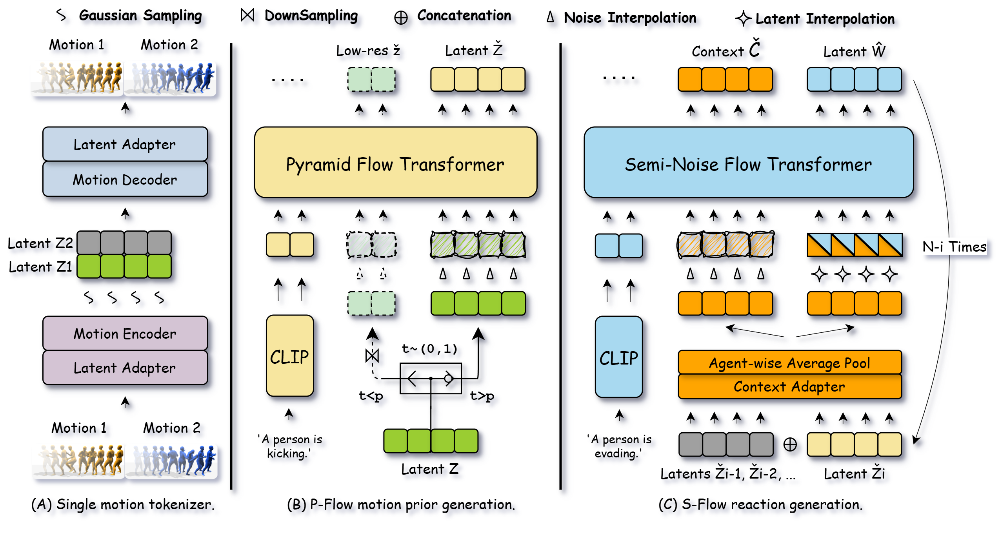

<div align="center">
  <h1>Unified Number-Free Text-to-Motion Generation <br> Via Flow Matching</h1>
  <p><strong>CVPR 2026</strong> &nbsp;|&nbsp; <strong>Guanhe Huang, Oya Celiktutan</strong></p>

  <p>
    <a href="https://arxiv.org/abs/2603.27040">
      
    </a>
    <a href="https://githubhgh.github.io/umf/">
      
    </a>
    <a href="LICENSE">
      
    </a>
    <a href="#">
      
    </a>
    <a href="#">
      
    </a>
    <a href="#">
      
    </a>
  </p>

  <br>
  
</div>

---

## 📌 Abstract

> *Generative models excel at motion synthesis for a fixed number of agents but struggle to generalize with variable agents. Based on limited, domain-specific data, existing methods employ autoregressive models to generate motion recursively, which suffer from inefficiency and error accumulation. We propose **Unified Motion Flow (UMF)**, which consists of **Pyramid Motion Flow (P-Flow)** and **Semi-Noise Motion Flow (S-Flow)**. UMF decomposes the number-free motion generation into a single-pass motion prior generation stage and multi-pass reaction generation stages. Specifically, UMF utilizes a unified latent space to bridge the distribution gap between heterogeneous motion datasets, enabling effective unified training. For motion prior generation, P-Flow operates on hierarchical resolutions conditioned on different noise levels, thereby mitigating computational overheads. For reaction generation, S-Flow learns a joint probabilistic path that adaptively performs reaction transformation and context reconstruction, alleviating error accumulation. Extensive results and user studies demonstrate UMF's effectiveness as a generalist model for multi-person motion generation from text.*

---

## 🔧 1. Installation

### System Configuration

| Component | Version |
|:---------:|:-------:|
| GPU | NVIDIA H200 |
| CUDA | 12.8 |
| Python | 3.9.x |
| OS | Linux |

> **Note:** This project (except for the VAE training) uses less than **24 GB** GPU memory, so it should also work with CUDA 11.x and other GPUs. If you encounter CUDA-related issues, please check the PyTorch installation and CUDA compatibility first.

### Clone the Repository
```bash
git clone https://github.com/Githubhgh/UMF_CVPR.git
cd UMF_CVPR
```

### ⚡ Option A — Recommended: `uv` (fast)

We recommend using the existing `pyproject.toml` with `uv`, which has been validated for Python 3.9.

```bash
# Install uv if needed
pip install uv

# Create and sync environment
uv init
uv sync

# Activate
source .venv/bin/activate

# Verify
python -c "import torch; print(torch.__version__, torch.version.cuda)"
```

### 🐍 Option B — Pure pip

```bash
python -m venv .venv
source .venv/bin/activate
pip install --upgrade pip setuptools wheel
pip install -r requirements.txt
```

---

## 📦 2. Data and Pretrained Models

### Dataset Preparation

Place or symlink the **InterHuman** and **HumanML3D** datasets into the `./data/` directory.

| Dataset | Source |
|---------|--------|
| HumanML3D | [GitHub](https://github.com/EricGuo5513/HumanML3D) |
| InterHuman (InterGen) | [GitHub](https://github.com/tr3e/InterGen) |

Expected directory structure:

```
./data/
├── InterHuman/
│   ├── annots/
│   ├── motions/
│   ├── motions_processed/
│   └── split/
└── HUMANML3D/
    ├── texts/
    ├── new_joint_vecs/
    └── new_joints/
```

### Pretrained Checkpoints

| Checkpoint | Location | Download |
|------------|----------|----------|
| Evaluation (`interclip.ckpt`) | `./eval_model/interclip.ckpt` | [InterHuman Source](https://github.com/tr3e/InterGen) |
| UMF | update path in config | [Google Drive](https://drive.google.com/file/d/1jmGD3wvXcig43uyV63BeqZPjFxd3uBV-/view?usp=drive_link) |
| VAE | update path in config | [Google Drive](https://drive.google.com/file/d/14OCETIMfrZf-ZCPTq4xWMhNK5w7dY7Eu/view?usp=sharing) |

### Configuration Verification

Before proceeding, ensure the following paths are correctly set:

| File | Keys to verify |
|------|---------------|
| `configs/datasets.yaml` | all dataset root paths |
| `configs/assets.yaml` | `model.t2m_path`, `DATASET.*.ROOT` |

---

## 🚀 3. Training Pipeline

Training is divided into **three sequential stages** as described in the paper:

```
Stage 1 ──────────────▶  Stage 2 ──────────────▶  Stage 3
Motion VAE           P-Flow (indi)           S-Flow (react)
(config_vae)        (config_pflow)          (config_sflow)
```

### Stage 1 — Motion Heterogeneous VAE

```bash
python train_UMF.py \
  --cfg configs/config_vae.yaml \
  --cfg_assets configs/assets.yaml \
  --batch_size 64 \
  --nodebug
```

> 💡 **VS Code**: use the **Train VAE (stage1)** launcher.

### Stage 2 — Pyramid Motion Flow: Individual Denoiser (`indi_denoiser`)

> **Prerequisite**: set `TRAIN.PRETRAINED_VAE` → Stage 1 checkpoint; `TRAIN.DIFFUSION_MODE` → `indi`.

```bash
python train_UMF.py \
  --cfg configs/config_pflow.yaml \
  --cfg_assets configs/assets.yaml \
  --batch_size 64 \
  --nodebug
```

> 💡 **VS Code**: use the **Train P-Flow (indi_denoiser)** launcher.

### Stage 3 — Semi-Noise Motion Flow: Reactive Denoiser (`reac_denoiser`)

> **Prerequisites**: set `TRAIN.PRETRAINED_VAE` → Stage 1; `TRAIN.PRETRAINED_INDI` → Stage 2; `TRAIN.DIFFUSION_MODE` → `react`.

```bash
python train_react.py \
  --cfg configs/config_sflow.yaml \
  --cfg_assets configs/assets.yaml \
  --batch_size 64 \
  --nodebug
```

> 💡 **VS Code**: use the **Train S-Flow (reac_denoiser)** launcher.

### ↩️ Resume Training

Set **both** flags when resuming:

| Flag | Purpose |
|------|---------|
| `TRAIN.RESUME` | experiment directory (config / logger recovery) |
| `TRAIN.PRETRAINED` | explicit `.ckpt` path passed to `trainer.fit` |

> `TRAIN.RESUME` alone is not enough — checkpoint auto-selection is intentionally disabled.

---

## 📊 4. Evaluation

Specify `TEST.CHECKPOINTS` in the relevant config, then run:

| Stage | Config | VS Code Launcher |
|-------|--------|-----------------|
| VAE (Stage 1) | `configs/config_vae.yaml` | **Test VAE** |
| Individual denoiser (Stage 2) | `configs/config_pflow.yaml` | **Test P-Flow** |
| Reactive denoiser (Stage 3) | `configs/config_sflow.yaml` | **Test S-Flow** |

```bash
# Stage 1
python test.py --cfg configs/config_vae.yaml   --cfg_assets configs/assets.yaml

# Stage 2
python test.py --cfg configs/config_pflow.yaml --cfg_assets configs/assets.yaml

# Stage 3
python test.py --cfg configs/config_sflow.yaml --cfg_assets configs/assets.yaml
```

---

## 📝 Citation

If you find this work useful, please cite our paper:

```bibtex
@article{huang2026unified,
  title={Unified Number-Free Text-to-Motion Generation Via Flow Matching},
  author={Huang, Guanhe and Celiktutan, Oya},
  journal={arXiv preprint arXiv:2603.27040},
  year={2026}
}
```

---

## 📬 Contact

For questions or issues, please open a GitHub issue or contact us at [guanhe.huang@kcl.ac.uk](mailto:guanhe.huang@kcl.ac.uk).

---

## 🙏 Acknowledgments

This project builds on the following excellent works:

| Project | Authors |
|---------|---------|
| [HumanML3D](https://github.com/EricGuo5513/HumanML3D) | Guo et al. |
| [InterGen](https://github.com/tr3e/InterGen) | Liang et al. |
| [MLD](https://github.com/ChenFengYe/motion-latent-diffusion) | Chen et al. |
| [MotionLCM](https://github.com/Dai-Wenxun/MotionLCM) | Dai et al. |
| [Pyramid-Flow](https://github.com/jy0205/Pyramid-Flow) | Jin et al. |
| [CLIP](https://github.com/openai/CLIP) | OpenAI |
| [SMPL](https://smpl.is.tue.mpg.de/) / [SMPL-X](https://smpl-x.is.tue.mpg.de/) | Max Planck Institute |

Please follow their respective licenses when using this code.

---

## 📄 License

This project is distributed under the [CC BY-NC 4.0 License](LICENSE).
